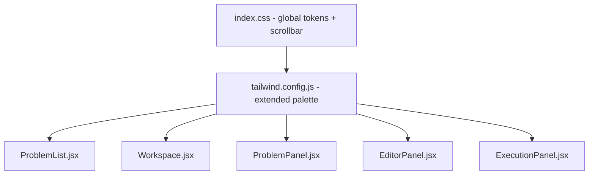

# Design Document: Premium Dark Theme UI

## Overview

This design covers the visual upgrade of the CodeForge DSA platform to a premium, developer-focused dark theme. The work is purely frontend — no backend changes, no routing changes, no API changes. The goal is to apply a consistent design system across all existing components and pages, improving readability, polish, and interaction feedback without altering any functional behavior.

The existing component structure is preserved:
- `ProblemList.jsx` — problem listing page
- `Workspace.jsx` — three-panel layout host
- `ProblemPanel.jsx` — left panel (problem statement)
- `EditorPanel.jsx` — center panel (Monaco editor)
- `ExecutionPanel.jsx` — right panel (run/submit/output)

The upgrade touches `index.css`, `tailwind.config.js`, and all five of the above files.

---

## Architecture

The upgrade follows a **design token + utility class** approach. All color, spacing, and typography decisions are expressed as Tailwind CSS utility classes. A small set of CSS custom properties in `index.css` anchors the global tokens (background, surface, border, text). No new component libraries are introduced.



The Monaco editor already uses `vs-dark` theme (confirmed in `EditorPanel.jsx`). The Tailwind Typography plugin (`@tailwindcss/typography`) is already installed and used in `ProblemPanel.jsx` via `prose prose-invert`.

---

## Components and Interfaces

### 1. Global Design System (`index.css` + `tailwind.config.js`)

Defines the shared token set. All components consume these tokens via Tailwind classes.

**Tokens:**

| Token | Value | Usage |
|---|---|---|
| `bg-page` | `#0f172a` | Page/root background |
| `bg-surface` | `#111827` | Panel and card backgrounds |
| `border-subtle` | `#1f2937` | All panel/component borders |
| `text-primary` | `#e5e7eb` | Main readable text |
| `text-muted` | `#9ca3af` | Labels, secondary text |
| `accent-blue` | `#3b82f6` | Run button, focus rings |
| `accent-green` | `#22c55e` | Submit button, Accepted status |
| `accent-yellow` | `#eab308` | Medium difficulty |
| `accent-red` | `#ef4444` | Hard difficulty, Wrong Answer |
| `accent-orange` | `#f97316` | Runtime Error |

Font: Inter (already imported in `index.css`). Line-height: `leading-relaxed` (1.625) applied globally via body rule.

### 2. ProblemPanel (`ProblemPanel.jsx`)

Renders problem title, difficulty/tag pills, description (via `react-markdown`), examples with code blocks, and constraints.

**Key interface:** `{ problem: ProblemShape | null }`

**Skeleton state:** When `problem` is null, renders animated `animate-pulse` placeholder blocks matching the real layout structure (title bar, pill row, text lines).

**Scrolling:** The root element uses `overflow-y-auto` with a fixed height inherited from the flex parent in `Workspace.jsx`.

### 3. EditorPanel (`EditorPanel.jsx`)

Wraps the Monaco editor with a sticky toolbar.

**Key interface:** `{ language, setLanguage, code, setCode }`

**Toolbar:** `sticky top-0 z-10` with language selector `<select>` and Reset Defaults button. Smooth `transition-colors` on all interactive elements.

**Monaco config:** `theme="vs-dark"`, `fontFamily` set to JetBrains Mono stack, `minimap: { enabled: false }`, smooth scrolling and cursor animation enabled.

### 4. ExecutionPanel (`ExecutionPanel.jsx`)

Handles run/submit actions and displays results.

**Key interface:** `{ problemId, language, code, customInput, setCustomInput, outputData, setOutputData, submitResult, setSubmitResult, isLoading, setIsLoading }`

**Sections (each in a boxed container):**
- Custom Input — `<textarea>` with monospace font
- Console Output — displays run output or submit results with status indicators and copy button

**Status indicators:**
- Accepted / All Passed → `text-[#22c55e]` + `CheckCircle2` icon
- Wrong Answer → `text-[#ef4444]` + `XCircle` icon
- Runtime Error → `text-[#f97316]` + `AlertTriangle` icon

**Copy button:** Toggles between `Copy` and `Check` icons; reverts after 2 seconds via `setTimeout`.

**Loading state:** Centered `Loader2` spinner + "Executing on server..." text replaces output area content while `isLoading` is true.

### 5. ProblemList (`ProblemList.jsx`)

Listing page with header, search/filter controls, and problems table.

**Key interface:** No props (fetches its own data).

**Header:** CodeForge logo icon (gradient `Terminal`) + wordmark + "DSA" badge.

**Table:** Rounded bordered container, row hover effect (`hover:bg-[#1e293b]/50`), difficulty pills matching Requirement 2 color mapping.

**Empty state:** When `filtered.length === 0`, renders a centered `Search` icon + descriptive message.

### 6. Workspace (`Workspace.jsx`)

Layout host. No visual logic of its own beyond the outer shell.

**Panel proportions:** `w-[30%]` / `w-[40%]` / `w-[30%]` with `min-w` guards. Each panel wrapped in `border border-[#1f2937] rounded-xl shadow-lg`.

---

## Data Models

No new data models are introduced. The existing shapes are:

```ts
// Problem (from API)
interface Problem {
  id: number;
  title: string;
  difficulty: 'Easy' | 'Medium' | 'Hard';
  tags: string[];
  description: string;       // markdown string
  examples: Example[];
  constraints: string;       // markdown string
}

interface Example {
  input: string;
  output: string;
  explanation?: string;
}

// Execution output (from runCode API)
interface OutputData {
  status: 'success' | 'error';
  output?: string;
  error?: string;
}

// Submit result (from submitCode API)
interface SubmitResult {
  passed: number;
  total: number;
  details: TestCaseDetail[];
  error?: string;
}

interface TestCaseDetail {
  testCaseNumber: number;
  passed: boolean;
  input: string;
  expectedOutput?: string;
  actualOutput?: string;
  status?: string;
  error?: string;
}
```

UI state is managed in `Workspace.jsx` and passed down as props — no state management library needed.

---

## Correctness Properties

*A property is a characteristic or behavior that should hold true across all valid executions of a system — essentially, a formal statement about what the system should do. Properties serve as the bridge between human-readable specifications and machine-verifiable correctness guarantees.*

### Property 1: Difficulty badge color mapping

*For any* problem with a difficulty value of Easy, Medium, or Hard, the rendered difficulty badge element should carry the correct color class: green (`#22c55e`) for Easy, yellow (`#eab308`) for Medium, and red (`#ef4444`) for Hard — in both `ProblemPanel` and `ProblemList`.

**Validates: Requirements 2.2, 7.4**

### Property 2: Tag pill shape

*For any* problem with one or more tags, each rendered tag element should carry the `rounded-full` class.

**Validates: Requirements 2.3**

### Property 3: Output text whitespace preservation

*For any* execution result (run output or submit result), all `<pre>` elements rendering output text should carry the `whitespace-pre-wrap` class so that formatting is preserved.

**Validates: Requirements 4.2**

### Property 4: Button hover variants present

*For any* primary action button (Run, Submit), the element should carry a `hover:` variant class that applies a darker background color, ensuring a brightness increase on hover.

**Validates: Requirements 5.4**

### Property 5: All interactive controls disabled during loading

*For any* render of `ExecutionPanel` where `isLoading` is true, all buttons that trigger execution (Run, Submit) should have the `disabled` attribute set and carry a reduced-opacity class (`disabled:opacity-50` or equivalent).

**Validates: Requirements 5.5, 6.3**

### Property 6: Status indicator correctness

*For any* execution result status value, the rendered status indicator should display the correct icon and color class: `CheckCircle2` with green text for Accepted/all-passed, `XCircle` with red text for Wrong Answer, and `AlertTriangle` with orange text for Runtime Error.

**Validates: Requirements 4.4, 4.5, 4.6**

---

## Error Handling

Since this feature is purely visual, error handling focuses on graceful degradation:

**Missing/loading problem data:**
- `ProblemPanel` renders a skeleton loader when `problem` is null (animate-pulse placeholder blocks). This prevents layout shift and communicates loading state.

**API/execution failures:**
- `ExecutionPanel` already catches errors in `handleRun` and `handleSubmit` and sets an error state on `outputData`/`submitResult`. The UI renders these with the Runtime Error status indicator (orange + warning icon).
- No changes to error handling logic are needed — only the visual presentation of error states is upgraded.

**Empty problem list:**
- `ProblemList` renders an empty state with a `Search` icon and descriptive message when `filtered.length === 0`. This covers both "no problems loaded" and "no search matches" cases.

**Monaco editor loading:**
- `EditorPanel` passes a custom `loading` prop to the Monaco `Editor` component that renders a spinner + "Loading editor..." text, preventing a blank panel flash.

---

## Testing Strategy

### Dual Testing Approach

Both unit tests and property-based tests are required. They are complementary:
- Unit tests verify specific examples, edge cases, and integration points
- Property tests verify universal rules that should hold across all inputs

### Property-Based Testing

**Library:** [fast-check](https://github.com/dubzzz/fast-check) — the standard PBT library for JavaScript/TypeScript.

**Configuration:** Each property test runs a minimum of 100 iterations (`numRuns: 100`).

**Tag format:** Each test is annotated with a comment:
`// Feature: premium-dark-theme-ui, Property {N}: {property_text}`

**Properties to implement (one test each):**

| Property | Test description |
|---|---|
| Property 1 | Generate arbitrary difficulty values from `['Easy','Medium','Hard']`, render badge, assert correct color class |
| Property 2 | Generate arbitrary tag arrays, render ProblemPanel, assert every tag element has `rounded-full` |
| Property 3 | Generate arbitrary output strings, render ExecutionPanel with outputData, assert all `<pre>` elements have `whitespace-pre-wrap` |
| Property 4 | For each primary button, assert presence of `hover:bg-[#2563eb]` or `hover:bg-[#16a34a]` class |
| Property 5 | Render ExecutionPanel with `isLoading=true`, assert all action buttons are disabled with opacity class |
| Property 6 | Generate arbitrary result status values, render ExecutionPanel, assert correct icon component and color class |

### Unit Tests

Unit tests focus on specific examples and edge cases that property tests don't cover well:

- **Skeleton loader:** Render `ProblemPanel` with `problem=null`, assert `animate-pulse` elements are present
- **Scrollable panel:** Assert `ProblemPanel` root has `overflow-y-auto`
- **Monaco theme:** Assert `Editor` receives `theme="vs-dark"` prop
- **Sticky toolbar:** Assert toolbar element has `sticky` and `top-0` classes
- **Copy button toggle:** Simulate copy click, assert icon changes to `Check`, assert revert after 2s
- **Loading spinner + message:** Render with `isLoading=true`, assert `Loader2` with `animate-spin` and "Executing on server..." text are present
- **Fade-in on result:** Assert result container has `animate-in fade-in` classes
- **Empty state:** Render `ProblemList` with empty filtered array, assert empty state message and icon are present
- **Three-panel layout:** Render `Workspace`, assert three panel divs with `w-[30%]`, `w-[40%]`, `w-[30%]` classes
- **Back-link:** Assert `Workspace` header contains a link to `"/"`
- **Run button color:** Assert Run button has `bg-[#3b82f6]` class
- **Submit button color:** Assert Submit button has `bg-[#22c55e]` class
- **Spinner in button during loading:** Render with `isLoading=true`, assert `Loader2` with `animate-spin` is inside the Run/Submit buttons

### Test Setup

Tests use **Vitest** + **@testing-library/react** (standard for Vite/React projects). Run with:

```bash
cd frontend && npx vitest --run
```

Test files live alongside components:
- `src/components/ProblemPanel.test.jsx`
- `src/components/EditorPanel.test.jsx`
- `src/components/ExecutionPanel.test.jsx`
- `src/pages/ProblemList.test.jsx`
- `src/pages/Workspace.test.jsx`
